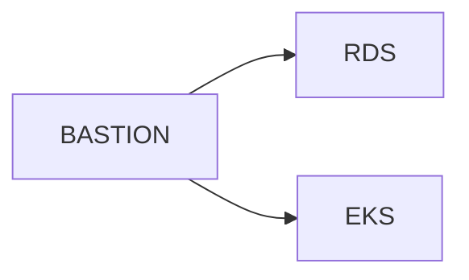

# architect  
- 테라폼으로 생성되는 아키텍처 구성도 그려넣기.

## 명령어
REGION_CHOICE값이 없으면 에러 발생  

### 모듈 생성 수동방법
```
# 0) 최초 1회: backend init
terraform init

# 1) 워크스페이스를 “환경-리전”으로 선택/생성
terraform workspace new {env}-{region_code}      # 최초 한 번
terraform workspace select {env}-{region_code}   # 배포할 환경-리전 워크스페이스
# ex: terraform workspace select dev-us || terraform workspace new dev-us

# 2) 워크스페이스와 동일한 이름의 tfvars 파일 지정하여 배포
terraform apply -var-file=variables/{env}/{env}-{region_code}.tfvars
```

### 모듈 삭제 수동방법
```
terraform destroy -var-file=variables/{env}/{env}-{region_code}.tfvars
```
<br>

## 📁 Layout
```
502Team-terraform/
├── modules/
│   ├── iam/ 
│   │   └── {main.tf, variables.tf, outputs.tf}
│   ├── vpc/
│   │   └── {main.tf, variables.tf, outputs.tf}
│   ├── eks/
│   │   └── {main.tf, variables.tf, outputs.tf}
│   ├── sg/
│   │   └── {main.tf, variables.tf, outputs.tf}
│   └── ec2/
│       └── {main.tf, variables.tf, outputs.tf}
├── variables/
│   ├── dev
│   │   ├── dev-eu.tfvars
│   │   └── dev-us.tfvars
│   ├── stg
│   │   ├── stg-eu.tfvars
│   │   └── stg-us.tfvars
│   └── prd
│       ├── prd-eu.tfvars
│       └── prd-us.tfvars
├── backend.tf
├── provider.tf
├── main.tf
└── outputs.tf
```

- `modules/`: 모든 환경 공통적으로 재사용 가능한 순수 모듈(외부 의존 최소화).   
- `variables/`: 각 환경(dev, stg, prd)별 변수 분리.
<br>

## Naming Rules
**[aws-serivce]-[project]-[env]-[service-name]-[regionCode]-[zone]**  

| aws-services       | naming rule                                                         |
| ------------------ | ------------------------------------------------------------------- |
| `vpc`              | `VPC-[PROJECT]-[ENV]-[REGION-CODE]`                                 |
| `subnet`           | `PUBLIC-SUBNET-[PROJECT]-[ENV]-[SERVICE-NAME]-[REGION-CODE]-[ZONE]` |
| `route table`      | `RTB-[PROJECT]-[ENV]-[SERVICE-NAME]-[REGION-CODE]`                  |
| `internet gateway` | `IGW-[PROJECT]-[ENV]-[SERVICE-NAME]-[REGION-CODE]`                  |
| `nat gateways`     | `NGW-[PROJECT]-[ENV]-[SERVICE-NAME]-[REGION-CODE]`                  |
| `elastic IPs`      | `EIP-[PROJECT]-[ENV]-[SERVICE-NAME]-[REGION-CODE] `                 | 
| `security groups`  | `SG-[PROJECT]-[ENV]-[SERVICE-NAME]-[REGION-CODE] `                  | 
| `ec2`              | `EC2-[PROJECT]-[ENV]-[SERVICE-NAME]-[REGION-CODE]-[ZONE]`           |
| `ami`              | `yyyymmdd-AMI-[EC2-NAME]`                                           |
| `ebs volumes`      | `EBS-[EC2-NAME]`                                                    |
| `snapshots`        | `SNAP-[EC2-NAME] `                                                  | 
| `key-pairs`        | `KEY-[EC2-SERVICE-NAME]`                                            |
| `load balancers`   | `[ALB/NLB]-[PROJECT]-[ENV]-[SERVICE-NAME]-[REGION-CODE]-[ZONE]`     |
| `ecr`              | `ECR-[PROJECT]-[ENV]-[SERVICE-NAME]-[REGION-CODE]`                  |
| `eks`              | `EKS-[PROJECT]-[ENV]-[CLUSTER-NAME]-[REGION-CODE]`                  |
| `s3`               | `S3-[PROJECT]-[ENV]-[BUCKET-NAME]-[REGION-CODE]`                    |
| `rds`              | `RDS-[PROJECT]-[ENV]-[SERVICE-NAME]-[REGION-CODE]`                  |
<br>

## NETWORK
### CIDR  
| RESOURCE           | RESOURCE NAME                                                            | CIDR                            |
| ------------------ | -------------------------------------------------------------------------| ------------------------------- |
| VPC                | VPC-FOT-DEV-EKS-AN2                                                      | 10.0.0.0/20                     |
| MGMT-PUBLIC-SUBNET | PUBLIC-SUBNET-FOT-DEV-MGMT-AN2-1A <br> PUBLIC-SUBNET-FOT-DEV-MGMT-AN2-2B | 10.0.0.0/26 <br> 10.0.0.64/26   |
| ELB-PUBLIC-SUBNET  | PUBLIC-SUBNET-FOT-DEV-ELB-AN2-1A <br> PUBLIC-SUBNET-FOT-DEV-ELB-AN2-2B   | 10.0.0.128/26 <br> 10.0.0.192/26|
| EKS-PRIVATE-SUBNET | PRIVATE-SUBNET-FOT-DEV-EKS-AN2-1A <br> PRIVATE-SUBNET-FOT-DEV-EKS-AN2-2B | 10.0.10.0/25 <br> 10.0.10.128/25|
| RDS-PRIVATE-SUBNET | PRIVATE-SUBNET-FOT-DEV-RDS-AN2-1A <br> PRIVATE-SUBNET-FOT-DEV-RDS-AN2-2B | 10.0.20.0/26 <br> 10.0.20.64/26 |


<!-- TD(Top Down)    : 세로 방향으로 다이어그램 생성 -->
<!-- LR(Left Right)  : 가로 방향으로 다이어그램 생성 -->

### ROUTE TABLES
#### 1. EKS  
- **RTB Name** : RTB-FOT-DEV-EKS-AN2  

| Destination | Target                 |
| ----------- | ---------------------- |
| 10.0.0.0/20 | local                  |
| 0.0.0.0/0   | NGW-FOT-DEV-PUBLIC-AN2 |

#### 2. ELB  
- **RTB Name** : RTB-FOT-DEV-ELB-AN2  

| Destination | Target              |
| ----------- | ------------------- |
| 10.0.0.0/20 | local               |
| 0.0.0.0/0   | IGW-FOT-DEV-ELB-AN2 |

#### 3. RDS  
- **RTB Name** : RTB-FOT-DEV-RDS-AN2  

| Destination | Target              |
| ----------- | ------------------- |
| 10.x.x.x/26 | local               |