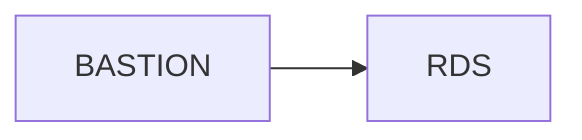
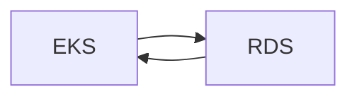

# architect  
- 테라폼으로 생성되는 아키텍처 구성도 그려넣기.

## Layout
```
502Team-terraform/
├─ README.md
├─ s3
│  ├─ vpc.tfstate
│  └─ sg.tfstate
├─ environments/
│  ├─ dev.yaml
│  ├─ stg.yaml
│  └─ prd.yaml
├─ modules/           # dev, stg, prd 공통 모듈
│  ├─ addons/
│  │  ├─ main.tf      # core addons(aws-ebs-csi, coredns 등) + helm 차트
│  │  ├─ variables.tf
│  │  └─ outputs.tf
│  ├─ vpc/
│  │  ├─ main.tf
│  │  ├─ variables.tf
│  │  └─ outputs.tf
│  ├─ eks/
│  │  ├─ main.tf      # EKS cluster, IRSA(OIDC), node groups
│  │  ├─ variables.tf
│  │  └─ outputs.tf
│  └─ iam/
│     ├─ main.tf      # cluster-admin role, IRSA용 IAM policy/role 등
│     ├─ variables.tf
│     └─ outputs.tf
└─ live/
   ├─ terragrunt.hcl    # backend 동적 자동화
   ├─ dev/
   │  ├─ env.hcl
   │  ├─ vpc/           # vpc, subnet, nat_gateway, internet_gateway, route_table
   |  |  ├─ main.tf
   |  |  ├─ variables.tf
   |  |  ├─ outputs.tf
   |  |  └─ backend.tf
   │  ├─ vpc-endpoint/
   |  |  ├─ main.tf
   |  |  ├─ variables.tf
   |  |  ├─ outputs.tf
   |  |  └─ backend.tf
   │  ├─ eni/
   |  |  ├─ main.tf
   |  |  ├─ variables.tf
   |  |  ├─ outputs.tf
   |  |  └─ backend.tf
   │  └─ sg/
   |     ├─ main.tf
   |     ├─ variables.tf
   |     ├─ outputs.tf
   |     └─ backend.tf
   ├─ stg/
   │  ├─ env.hcl
   │  ├─ vpc/           # vpc, subnet, nat_gateway, internet_gateway, route_table
   |  |  ├─ main.tf
   |  |  ├─ variables.tf
   |  |  ├─ outputs.tf
   |  |  └─ backend.tf
   │  ├─ vpc-endpoint/
   |  |  ├─ main.tf
   |  |  ├─ variables.tf
   |  |  ├─ outputs.tf
   |  |  └─ backend.tf
   │  ├─ eni/
   |  |  ├─ main.tf
   |  |  ├─ variables.tf
   |  |  ├─ outputs.tf
   |  |  └─ backend.tf
   │  └─ sg/
   |     ├─ main.tf
   |     ├─ variables.tf
   |     ├─ outputs.tf
   |     └─ backend.tf
   └─ prd/
      ├─ env.hcl
      ├─ vpc/           # vpc, subnet, nat_gateway, internet_gateway, route_table
      |  ├─ main.tf
      |  ├─ variables.tf
      |  ├─ outputs.tf
      |  └─ backend.tf
      ├─ vpc-endpoint/
      |  ├─ main.tf
      |  ├─ variables.tf
      |  ├─ outputs.tf
      |  └─ backend.tf
      ├─ eni/
      |  ├─ main.tf
      |  ├─ variables.tf
      |  ├─ outputs.tf
      |  └─ backend.tf
      └─ sg/
         ├─ main.tf
         ├─ variables.tf
         ├─ outputs.tf
         └─ backend.tf
```

- modules/: 모든 환경 공통적으로 재사용 가능한 순수 모듈(외부 의존 최소화).  
- live/: 실제 배포 단위. 환경(dev/stage/prod)과 리소스 도메인(vpc/eks/addons) 별 state 분리.  
- s3: 해당 디렉터리는 tfstate 등 민감 정보에 대한 파일을 저장하는 디렉터리로, git repo에 업로드 금지.
<br>

### 실행 명령어
```
REGION_CHOICE값이 없으면 에러 발생
REGION_CHOICE=eu terragrunt -chdir=live/${env}$/${stack}$ plan
REGION_CHOICE=us terragrunt -chdir=live/${env}$/${stack}$ plan
terraform -chdir=live/${env}/vpc init
terraform -chdir=live/${env}/vpc plan
terraform -chdir=live/${env}/vpc apply -var="env=${dev}" -auto-apporve
```
<br>

## Naming Rules
**[aws-serivce]-[project]-[env]-[service-name]-[regionCode]-[zone]**  

| aws-services       | naming rule  |
| ------------------ | ------------ |
| vpc                | VPC-FOT-[ENV]-[SERVICE]-[REGION] | 
| subnet             | PUBLIC-SUBNET-FOT-[ENV]-[SERVICE-NAME]-[REGION]-[ZONE] |
| route table        | RTB-FOT-[ENV]-[SERVICE-NAME]-[REGION] |
| internet gateway   | IGW-FOT-[ENV]-[SERVICE-NAME]-[REGION] |
| nat gateways       | NGW-FOT-[ENV]-[SERVICE-NAME]-[REGION] |
| elastic IPs        | EIP-FOT-[ENV]-[SERVICE-NAME]-[REGION] | 
| security groups    | SG-FOT-[ENV]-[SERVICE-NAME]-[REGION] | 
| ec2                | EC2-FOT-[ENV]-[SERVICE-NAME]-[REGION]-[ZONE] |
| ami                | yyyymmdd-AMI-[EC2-NAME] |
| ebs volumes        | EBS-[EC2-NAME] |
| snapshots          | SNAP-[EC2-NAME] | 
| key-pairs          | KEY-[EC2-SERVICE-NAME] |
| load balancers     | [ALB/NLB]-FOT-[ENV]-[SERVICE-NAME]-[REGION]-[ZONE] |
| ecr                | ECR-FOT-[ENV]-[SERVICE-NAME]-[REGION] |
| eks                | EKS-FOT-[ENV]-[CLUSTER-NAME]-[REGION] |
| s3                 | S3-FOT-[ENV]-[BUCKET-NAME]-[REGION] |
| rds                | RDS-FOT-[ENV]-[SERVICE-NAME]-[REGION] |
<br>

## NETWORK
### CIDR  
| RESOURCE           | RESOURCE NAME                                                            | CIDR                            |
| ------------------ | -------------------------------------------------------------------------| ------------------------------- |
| VPC                | VPC-FOT-DEV-EKS-AN2                                                      | 10.0.0.0/20                     |
| MGMT-PUBLIC-SUBNET | PUBLIC-SUBNET-FOT-DEV-MGMT-AN2-1A <br> PUBLIC-SUBNET-FOT-DEV-MGMT-AN2-2B | 10.0.0.0/26 <br> 10.0.0.64/26   |
| ELB-PUBLIC-SUBNET  | PUBLIC-SUBNET-FOT-DEV-ELB-AN2-1A <br> PUBLIC-SUBNET-FOT-DEV-ELB-AN2-2B   | 10.0.0.128/26 <br> 10.0.0.192/26|
| EKS-PRIVATE-SUBNET | PRIVATE-SUBNET-FOT-DEV-EKS-AN2-1A <br> PRIVATE-SUBNET-FOT-DEV-EKS-AN2-2B | 10.0.10.0/25 <br> 10.0.10.128/25|
| RDS-PRIVATE-SUBNET | PRIVATE-SUBNET-FOT-DEV-RDS-AN2-1A <br> PRIVATE-SUBNET-FOT-DEV-RDS-AN2-2B | 10.0.20.0/26 <br> 10.0.20.64/26 |



<!-- TD(Top Down)    : 세로 방향으로 다이어그램 생성 -->
<!-- LR(Left Right)  : 가로 방향으로 다이어그램 생성 -->

### ROUTE TABLES
#### 1. EKS  
- **RTB Name** : RTB-FOT-DEV-EKS-AN2  

| Destination | Target                 |
| ----------- | ---------------------- |
| 10.0.0.0/20 | local                  |
| 0.0.0.0/0   | NGW-FOT-DEV-PUBLIC-AN2 |

#### 2. ELB  
- **RTB Name** : RTB-FOT-DEV-ELB-AN2  

| Destination | Target              |
| ----------- | ------------------- |
| 10.0.0.0/20 | local               |
| 0.0.0.0/0   | IGW-FOT-DEV-ELB-AN2 |

#### 3. RDS  
- **RTB Name** : RTB-FOT-DEV-RDS-AN2  

| Destination | Target              |
| ----------- | ------------------- |
| 10.x.x.x/26 | local               |