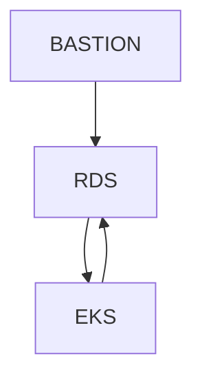

# architect  
- 테라폼으로 생성되는 아키텍처 구성도 그려넣기.

## Layout
```
502Team-terraform/
├─ README.md
├─ environments/
│  ├─ dev.yaml
│  ├─ stg.yaml
│  └─ prd.yaml
├─ modules/           # dev, stg, prd 공통 모듈
│  ├─ vpc/
│  │  ├─ main.tf      # VPC, 서브넷, 라우팅, NAT
│  │  ├─ variables.tf
│  │  └─ outputs.tf
│  ├─ eks/
│  │  ├─ main.tf      # EKS cluster, IRSA(OIDC), node groups
│  │  ├─ variables.tf
│  │  └─ outputs.tf
│  ├─ addons/
│  │  ├─ main.tf      # core addons(aws-ebs-csi, coredns 등) + helm 차트
│  │  ├─ variables.tf
│  │  └─ outputs.tf
│  └─ iam/
│     ├─ main.tf      # cluster-admin role, IRSA용 IAM policy/role 등
│     ├─ variables.tf
│     └─ outputs.tf
└─ live/              # 환경 별 add-ons 등 추가하기.
   ├─ dev/
   ├─ stg/
   └─ prd/  
```
- modules/: 모든 환경 공통적으로 재사용 가능한 순수 모듈(외부 의존 최소화).  
- live/: 실제 배포 단위. 환경(dev/stage/prod)과 리소스 도메인(vpc/eks/addons) 별 state 분리.  
<br>

### 실행 명령어
```
terraform init
terraform plan ~
terraform apply ~
```
<br>

## Naming Rules
1. AWS Services  
`[aws-serivce]-[project]-[env]-[app-service]-[regionCode]-[Zone]`  
ex: alb-502team-dev-web-an2-1a  
- VPC쪽은 대문자  
- 이외에는 소문자  

| aws-services       | naming rule  |
| ------------------ | ------------ |
| vpc                | VPC-FOT-DEV-<SERVICE>-AN2 | 
| subnet             | PUBLIC-SUBNET-FOT-DEV-<SERVICE-NAME>-AN2-1A <br> PRIVATE-SUBNET-FOT-DEV-<SERVICE-NAME>-AN2-2B |
| route table        | RTB-FOT-DEV-<SERVICE-NAME>-AN2 |
| internet gateway   | IGW-FOT-DEV-ELB-AN2 |
| nat gateways       | NGW-FOT-DEV-PUBLIC-AN2 |
| elastic IPs        | EIP-FOT-DEV-<SERVICE-NAME>-AN2 | 
| security groups    | SG-FOT-DEV-<SERVICE-NAME>-AN2 | 
| ec2                | EC2-FOT-DEV-<SERVICE-NAME>-AN2-1A/2B |
| ami                | yyyymmdd-AMI-<EC2-NAME> |
| ebs volumes        | EBS-<EC2-NAME> |
| snapshots          | SNAP-<EC2-NAME> | 
| key-pairs          | KEY-<EC2-SERVICE-NAME> |
| load balancers     | ALB/NLB-FOT-DEV-<SERVICE-NAME>-AN2-1A/2B |
| ecr                | ECR-FOT-DEV-<SERVICE-NAME>-AN2 |
| eks                | EKS-FOT-DEV-<CLUSTER-NAME>-AN2 |
| s3                 | S3-FOT-DEV-??-AN2 |
| rds                | RDS-FOT-DEV-<SERVICE-NAME>-AN2 |
<br>

## NETWORK
### CIDR  
#### 1. EKS (Application Service)  
| RESOURCE      | RESOURCE NAME                                                                | CIDR                           |
| ------------- | ---------------------------------------------------------------------------- | ------------------------------ |
| VPC           | VPC-FOT-DEV-EKS-AN2                                                          | 10.0.0.0/20                    |
| PUBLIC-SUBNET | PUBLIC-SUBNET-FOT-DEV-EKS-AN2-1A <br> PUBLIC-SUBNET-FOT-DEV-EKS-AN2-2B       | 10.0.1.0/24 <br> 10.0.2.0/24   |
| PUBLIC-SUBNET | PUBLIC-SUBNET-FOT-DEV-ELB-AN2-1A <br> PUBLIC-SUBNET-FOT-DEV-ELB-AN2-2B       | 10.0.1.0/24 <br> 10.0.2.0/24   |
| PRIVATE-SUBNET| PRIVATE-SUBNET-FOT-DEV-EKS-AN2-1A <br> PRIVATE-SUBNET-FOT-DEV-EKS-AN2-2B     | 10.0.10.0/24 <br> 10.0.20.0/24 |
| RDS-SUBNET    | PRIVATE-SUBNET-FOT-DEV-RDS-AN2-1A <br> PRIVATE-SUBNET-FOT-DEV-RDS-AN2-2B     | 10.0.30.0/24 <br> 10.0.40.0/24 |

#### 2. RDS  
| RESOURCE      | RESOURCE NAME                                                                | CIDR                           |
| ------------- | ---------------------------------------------------------------------------- | ------------------------------ |
| VPC           | VPC-FOT-DEV-RDS-AN2                                                          |                                |
| PRIVATE-SUBNET| PRIVATE-SUBNET-FOT-DEV-RDS-AN2-1A <br> PRIVATE-SUBNET-FOT-DEV-RDS-AN2-2B     | 10.x.x.x/26 <br> 10.x.x.x/26   |


### VPC Peering  
VPC-FOT-DEV-EKS-AN2 <-> VPC-FOT-DEV-MGMT-AN2  
VPC-FOT-DEV-EKS-AN2 <-> VPC-FOT-DEV-RDS-AN2  
- MGMT DB-BASTION서버의 NAT IP를 RDS에 접근 가능하도록 RBS-SG Inbound에 추가한다. (VPC Peering X)  



### ROUTE TABLES
#### 1. EKS  
| Route Table         | Destination | Target                 |
| ------------------- | ----------- | ---------------------- |
| RTB-FOT-DEV-EKS-AN2 | 10.0.0.0/20 | local                  |
|                     | 0.0.0.0/0   | NGW-FOT-DEV-PUBLIC-AN2 |

#### 2. ELB  
| Route Table         | Destination | Target              |
| ------------------- | ----------- | ------------------- |
| RTB-FOT-DEV-ELB-AN2 | 10.0.0.0/20 | local               |
|                     | 0.0.0.0/0   | IGW-FOT-DEV-ELB-AN2 |

#### 3. RDS (RTB-FOT-DEV-RDS-AN2)  
| Route Table         | Destination | Target              |
| ------------------- | ----------- | ------------------- |
| RTB-FOT-DEV-RDS-AN2 | 10.x.x.x/26 | local               |